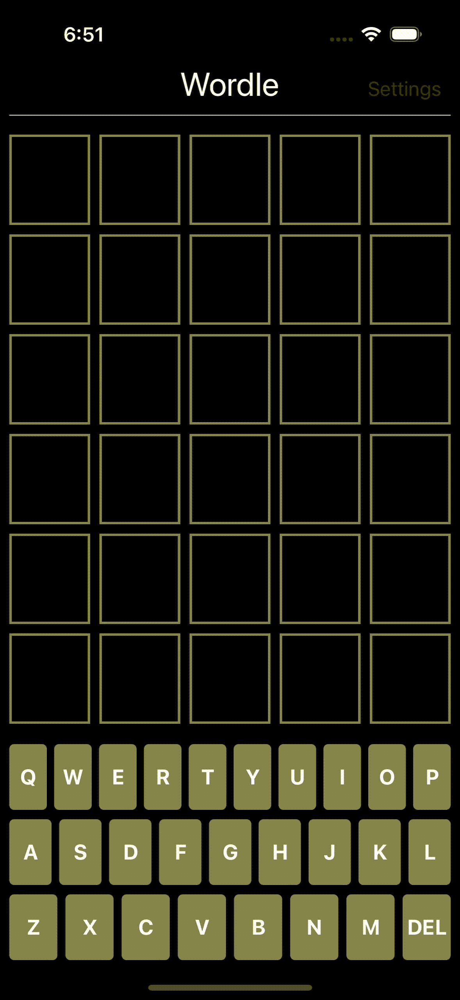
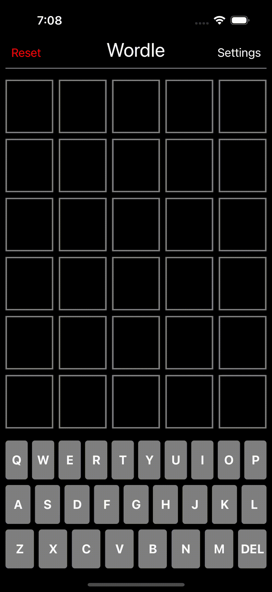

# Project 2 - *Wordle 2.0*

Submitted by: **Vasanth Banumurthy**

**Wordle 2.0** is an app that wordles more than wordle. 

Time spent: **2** hours spent in total

## Required Features

The following **required** functionality is completed:

- [X] User can change the number of letters per row (the length of the goal word)  
      
- [X] User can change the numbers of rows on the board (how many guesses allowed)  
      
- [X] User can select a new themed set to pull the goal word from  
      
- [X] User can select "alien wordle", causing the goal word to change after each guess  
      

The following **optional** features are implemented:

- [X] App displays a reset button on the top left to reset the game (but make no changes to the settings)  
      

The following **additional** features are implemented:

N/A

## Video Walkthrough

Here is a reminder on how to embed Loom videos on GitHub. Feel free to remove this reminder once you upload your README. 

[Watch Here](https://drive.google.com/file/d/1_fBPejYnwbZEwSXllDBDTh60AjrScoYE/view?usp=sharing) .

## Notes

N/A

## License

    Copyright [2023] [Vasanth Banumurthy]

    Licensed under the Apache License, Version 2.0 (the "License");
    you may not use this file except in compliance with the License.
    You may obtain a copy of the License at

        http://www.apache.org/licenses/LICENSE-2.0

    Unless required by applicable law or agreed to in writing, software
    distributed under the License is distributed on an "AS IS" BASIS,
    WITHOUT WARRANTIES OR CONDITIONS OF ANY KIND, either express or implied.
    See the License for the specific language governing permissions and
    limitations under the License.
